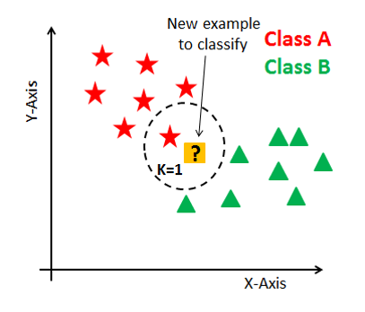
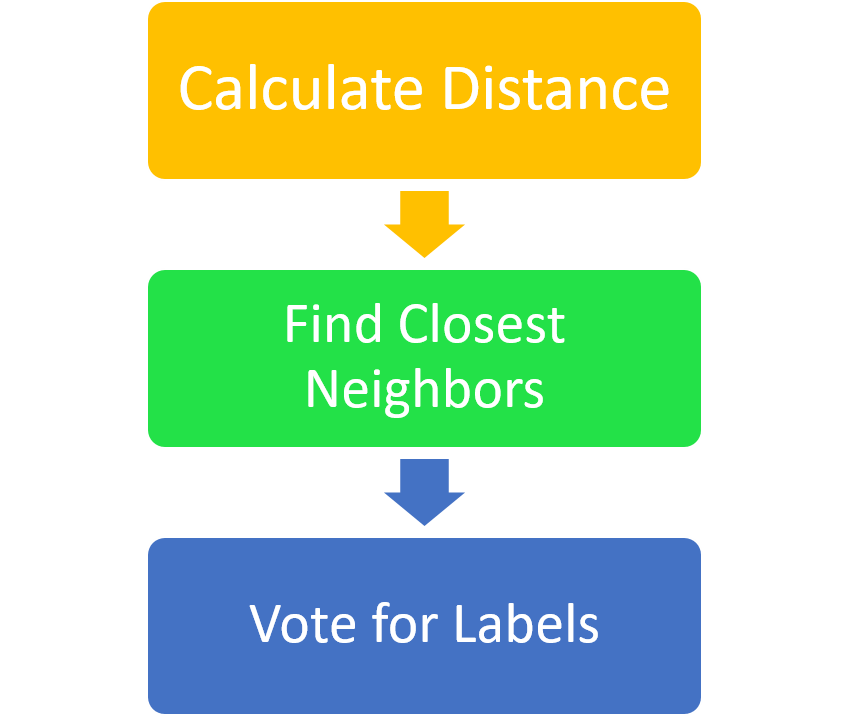
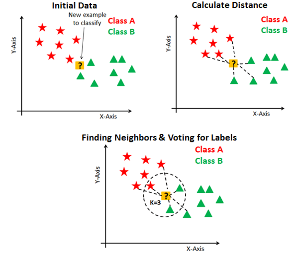
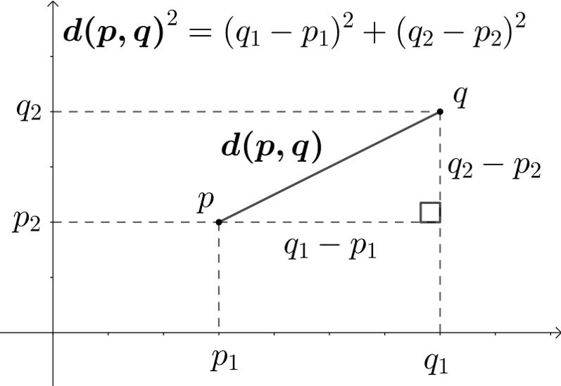
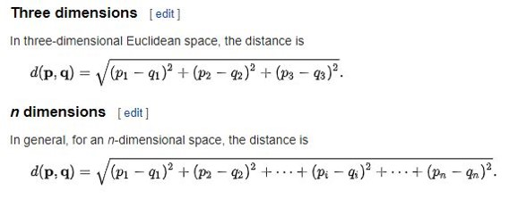
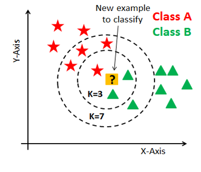
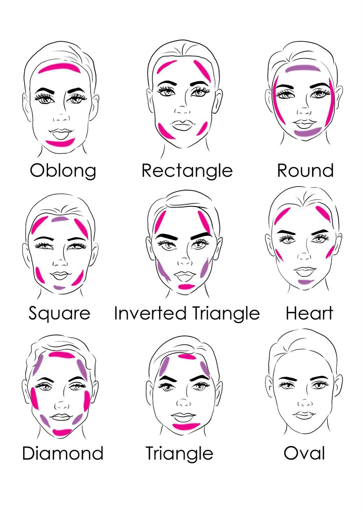
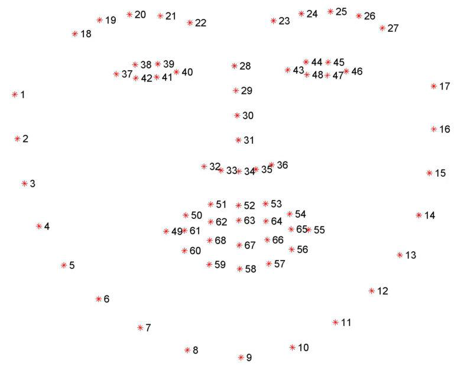

# Week-03
## Classification Machine Learning Algorithms Part I - K Nearest Neighbors Classifier

In Week 03 we discussed about the KNN Classifier, which is one of the most simplest Supervised Type Classification Machine Learning Algorithm

### KNN Classifier

- K Nearest Neighbor(KNN) is a very simple, easy to understand, versatile and one of the topmost machine learning algorithms. 
- KNN used in the variety of applications such as finance, healthcare, political science, handwriting detection, image recognition and video recognition. 
- In Credit ratings, financial institutes will predict the credit rating of customers
- In loan disbursement, banking institutes will predict whether the loan is safe or risky. 
- In political science, classifying potential voters in two classes will vote or won’t vote. 
KNN algorithm used for both classification and regression problems. KNN algorithm based on feature similarity approach.

### Functionality

- In KNN, K is the number of nearest neighbors. The number of neighbors is the core deciding factor. 
- K is generally an odd number if the number of classes is 2. When K=1, then the algorithm is known as the nearest neighbor algorithm. This is the simplest case. 
- Suppose P1 is the point, for which label needs to predict. First, you find the one closest point to P1 and then the label of the nearest point assigned to P1.



- Suppose P1 is the point, for which label needs to predict. 
- First, you find the k closest point to P1 and then classify points by majority vote of its k neighbors. 
- Each object votes for their class and the class with the most votes is taken as the prediction. 
- For finding closest similar points, you find the distance between points using distance measures such as Euclidean distance, Hamming distance, Manhattan distance and Minkowski distance.





#### How to find the distance Between Points - Euclidean Distance




#### K value

- Research has shown that no optimal number of neighbors suits all kind of data sets. 
- Each dataset has it's own requirements. 
- In the case of a small number of neighbors, the noise will have a higher influence on the result, and a large number of neighbors make it computationally expensive.
- Research has also shown that a small amount of neighbors are most flexible fit which will have low bias but high variance and a large number of neighbors will have a smoother decision boundary which means lower variance but higher bias.
- K value can be set in scikit learn as mentioned below

```python
from sklearn.neighbors import KNeighborsClassifier
clsfr=KNeighborsClassifier(n_neighbors=3)
```

- Generally, Data scientists choose as an odd number if the number of classes is even. 
- You can also check by generating the model on different values of k and check their performance. You can also try Elbow method



#### Points to Remember

- The training phase of K-nearest neighbor classification is much faster compared to other classification algorithms.  
- KNN can be useful in case of nonlinear data. It can be used with the regression problem. 
- Output value for the object is computed by the average of k closest neighbors value. 
- The testing phase of K-nearest neighbor classification is slower and costlier in terms of time and memory. 
- Euclidean distance is sensitive to magnitudes, therefore KNN also not suitable for large dimensional data.  


## Classification Machine Learning Algorithms Part I - K Nearest Neighbors Classifier

### Problem

Predicting the Face type of a person according to the 6 standard Face Types





### Defining the Labels

**With the problem statement, labels of the Machine Learning problem will be defined**

In this case labels will be defined as 6 standard Face Types

### Defining the Features

**In Machine Learning Feature extraction/ Defining features is done by human.**

for this problem we are going to define features with the 68 Landmarks of face detecting algorithm 

[read more about the algorithm](https://www.pyimagesearch.com/2017/04/03/facial-landmarks-dlib-opencv-python/)



Using the 68 Landmarks (points) the features will be defined,

Every point of the 68 points will contain (x,y) coordinates of the point.

- Let's denote the 68 points as (p1,p2,p3.....,p68)
- Then each and every points has (x,y) coordinates, for example p1[0] will be the x coordinate of the point 1,p1[1] will be the y cooedinate of point 1.

<img src="Images/Picture10.png" width="400
<img src="Images/Picture9.png" width="400

- As you can see in the Image the, Shape of a human face is almost defined by the p3,p4,p5,p6,p7,p8 and p9 (Assuming the face is almost symmetric)
- Then we can define the features as distances(along x axis) between the p3,p4,p5,p6,p7,p8 and p9 point.
- Then features can be defined as,

d1=p9[0]-p3[0]

d2=p9[0]-p4[0]

d3=p9[0]-p5[0]

d4=p9[0]-p6[0]

d5=p9[0]-p7[0]

d6=p9[0]-p8[0]

- But you will understand that, when the face is cloaser to the camera these d1,d2,..d6 distance will be increased. And when the face is far from the camera these distance will be decreased. There for using d1,d2,..d6 as feature is not effective since they are going to vary with the distance to the face from the camera.

- Therefore we are going to get a ratio, where d2,d3,d4,d5,d6 will be devided by the largest length d1, then the new feature set will be defined as,


D1=d2/d1

D2=d3/d1

D3=d4/d1

D4=d5/d1

D5=d6/d1

This feature set will not be varied with the distance from the camera to the face, therefore we can assume that these faeature are dependede only on the face type.

**Now We can apply this problem into a machine learning algorithm as we have defined features and labels**
